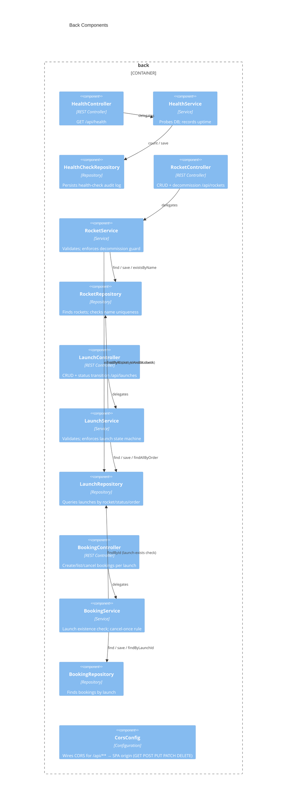

# Back architecture — My-Investor (ab-java-react)

> Container `back` from [`system.arch.md`](./system.arch.md). Tier: `back`.

## Overview

The `back` container is a Java 21 + Spring Boot 3.5 REST API that implements four domains — **health**, **rockets**, **launches**, and **bookings** — exposed under `/api/*`. Business rules (validation, state machine, decommission guard) live entirely in services; controllers handle only HTTP mapping and exception routing. Data is persisted to a local SQLite file via JPA/Hibernate.

- **Folder**: `back/`
- **Archetype**: Java 21 — Spring Boot 3.5 (web, data-jpa)
- **Talks to**: `db` (SQLite via JDBC/JPA); accepts calls from `front` and `e2e`

---

## Components diagram (C4 L3)



### Code organization

**Pattern**: Feature-based (one package per domain), layered within each feature.

```text
back/src/main/java/dev/aiddbot/abjavareact/
├── AbJavaReactApplication.java         # entry point; ensures data/ directory exists
├── bookings/
│   ├── Booking.java                    # @Entity; cancel() domain method; @ManyToOne Launch
│   ├── BookingController.java          # POST/GET /api/launches/{id}/bookings; GET /api/bookings/{id}; PATCH /api/bookings/{id}/cancel
│   ├── BookingRepository.java          # findByLaunchId
│   ├── BookingRequest.java             # record (passengerName, passengerEmail, passengerPhone) — @NotBlank
│   ├── BookingResponse.java            # record (id, launchId, passenger fields, status lowercase)
│   ├── BookingService.java             # launch-exists check; cancel-once rule
│   ├── BookingStatus.java              # enum CREATED → CANCELLED
│   └── ErrorResponse.java              # record (message) — error envelope
├── health/
│   ├── HealthCheck.java                # @Entity; audit log record
│   ├── HealthCheckRepository.java      # JpaRepository<HealthCheck, Long>
│   ├── HealthController.java           # GET /api/health
│   ├── HealthResponse.java             # record (status, database, uptime, timestamp)
│   └── HealthService.java              # probes DB; persists audit log quietly
├── launches/
│   ├── ErrorResponse.java              # record (message) — error envelope
│   ├── Launch.java                     # @Entity; state machine via transitionTo()
│   ├── LaunchController.java           # POST/GET/PUT /api/launches; PATCH /{id}/status
│   ├── LaunchRepository.java           # existsByRocket_IdAndStatusIn; findAllByOrderByScheduledAtDesc
│   ├── LaunchRequest.java              # record (rocketId, scheduledAt, pricePerTicket, minimumOccupancy)
│   ├── LaunchResponse.java             # record (id, rocketId, rocketName, scheduledAt, ...)
│   ├── LaunchService.java              # validation; state machine enforcement
│   ├── LaunchStatus.java               # enum CREATED → CONFIRMED → COMPLETED / CANCELLED
│   └── LaunchStatusRequest.java        # record (status)
├── rockets/
│   ├── ErrorResponse.java              # record (message) — error envelope
│   ├── Rocket.java                     # @Entity; update() / decommission() domain methods
│   ├── RocketController.java           # POST/GET/PUT/DELETE /api/rockets
│   ├── RocketRepository.java           # existsByName; existsByNameAndIdNot
│   ├── RocketRequest.java              # record (name, capacity, range)
│   ├── RocketResponse.java             # record (id, name, capacity, range, decommissioned)
│   └── RocketService.java              # validation; decommission guard
└── shared/
    └── CorsConfig.java                 # WebMvcConfigurer; /api/** CORS for SPA origin
```

### Key contracts

| Contract | Shape | Direction |
|----------|-------|-----------|
| `GET /api/health` | → `HealthResponse` | exposes |
| `POST /api/rockets` | `RocketRequest` → `RocketResponse` (201) | exposes |
| `GET /api/rockets` | → `List<RocketResponse>` | exposes |
| `PUT /api/rockets/{id}` | `RocketRequest` → `RocketResponse` | exposes |
| `DELETE /api/rockets/{id}` | → 204 No Content (soft delete) | exposes |
| `POST /api/launches` | `LaunchRequest` → `LaunchResponse` (201) | exposes |
| `GET /api/launches` | → `List<LaunchResponse>` (ordered scheduledAt desc) | exposes |
| `GET /api/launches/{id}` | → `LaunchResponse` | exposes |
| `PUT /api/launches/{id}` | `LaunchRequest` → `LaunchResponse` (CREATED status only) | exposes |
| `PATCH /api/launches/{id}/status` | `LaunchStatusRequest` → `LaunchResponse` | exposes |
| `POST /api/launches/{launchId}/bookings` | `BookingRequest` → `BookingResponse` (201) | exposes |
| `GET /api/launches/{launchId}/bookings` | → `List<BookingResponse>` | exposes |
| `GET /api/bookings/{id}` | → `BookingResponse` | exposes |
| `PATCH /api/bookings/{id}/cancel` | → `BookingResponse` (409 if already cancelled) | exposes |
| Error envelope | `ErrorResponse { message }` (400 / 404 / 409) | exposes |

---

## Data Schemas

### Tables (Hibernate `ddl-auto: update`, SQLite at `back/data/app.db`)

**health_check**

| Column | Type | Constraints |
|--------|------|-------------|
| id | BIGINT | PK, auto-increment |
| status | TEXT | NOT NULL |
| database_status | TEXT | NOT NULL |
| uptime_seconds | BIGINT | NOT NULL |
| checked_at | TEXT | NOT NULL (ISO-8601) |

**rocket**

| Column | Type | Constraints |
|--------|------|-------------|
| id | TEXT | PK, UUID |
| name | TEXT | NOT NULL, UNIQUE |
| capacity | INT | NOT NULL (1–9) |
| range | TEXT | NOT NULL (Earth \| Moon \| Mars) |
| decommissioned | BOOLEAN | NOT NULL, default false |

**launch**

| Column | Type | Constraints |
|--------|------|-------------|
| id | TEXT | PK, UUID |
| rocket_id | TEXT | FK → rocket.id, NOT NULL, EAGER |
| scheduled_at | DATETIME | NOT NULL (future ISO-8601 datetime) |
| price_per_ticket | DOUBLE | NOT NULL (> 0) |
| minimum_occupancy | INT | NOT NULL (1 ≤ x ≤ rocket.capacity) |
| status | TEXT | NOT NULL (CREATED \| CONFIRMED \| COMPLETED \| CANCELLED) |

**booking**

| Column | Type | Constraints |
|--------|------|-------------|
| id | TEXT | PK, UUID |
| launch_id | TEXT | FK → launch.id, NOT NULL, EAGER |
| passenger_name | TEXT | NOT NULL |
| passenger_email | TEXT | NOT NULL |
| passenger_phone | TEXT | NOT NULL |
| status | TEXT | NOT NULL (CREATED \| CANCELLED) |

### Launch state machine

```
CREATED ──► CONFIRMED ──► COMPLETED
   │              │
   └──────────────┴──────► CANCELLED
```

### Booking state machine

```
CREATED ──► CANCELLED   (one-way; cancelled bookings cannot be reactivated, never deleted)
```

> last updated: 2026-06-12
