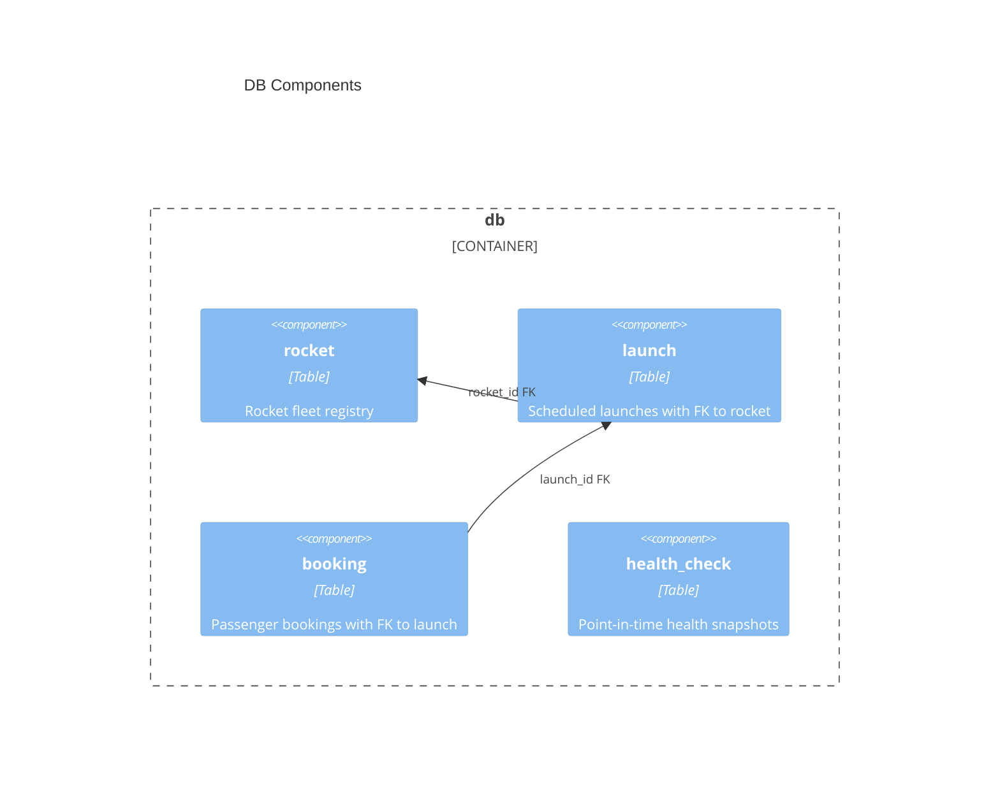

# DB architecture — My-Investor

> Container `db` from [`system.arch.md`](./system.arch.md). Tier: `db`.

## Overview

The `db` container is a SQLite file at `back/data/app.db`. It has no migration scripts; Hibernate's `ddl-auto: update` evolves the schema automatically from JPA `@Entity` classes in `back`. It stores the rocket/launch/booking domain plus independent health checks.

- **Folder**: `back/data/`
- **Archetype**: SQLite — Hibernate 6 (community dialect)
- **Talks to**: `back` (sole read/write client via JDBC)

---

## Components diagram (C4 L3)



### Code organization

**Pattern**: Single file; schema declared by JPA entities in `back/`.

```text
back/data/
└── app.db    # SQLite file; Hibernate owns schema lifecycle
```

### Key contracts

| Contract | Shape | Direction |
|----------|-------|-----------|
| JDBC URL | `jdbc:sqlite:data/app.db` | consumes |
| DDL owner | Hibernate `ddl-auto: update` | exposes |
| Dialect | `org.hibernate.community.dialect.SQLiteDialect` | consumes |
| Test URL | `jdbc:sqlite:target/test-health.db`, `ddl-auto: create-drop` | exposes |

---

## Data Schemas

### `rocket`

| Column | Type | Constraints |
|--------|------|-------------|
| `id` | TEXT (UUID) | PK, Hibernate-generated |
| `name` | TEXT | NOT NULL, UNIQUE |
| `capacity` | INTEGER | NOT NULL |
| `range` | TEXT | NOT NULL |
| `decommissioned` | INTEGER (boolean) | NOT NULL, default `0` |

### `launch`

| Column | Type | Constraints |
|--------|------|-------------|
| `id` | TEXT (UUID) | PK, Hibernate-generated |
| `rocket_id` | TEXT | NOT NULL, FK → `rocket.id` |
| `scheduled_at` | TEXT (ISO datetime) | NOT NULL |
| `price_per_ticket` | REAL | NOT NULL |
| `minimum_occupancy` | INTEGER | NOT NULL |
| `status` | TEXT (enum string) | NOT NULL; values: `CREATED`, `CONFIRMED`, `COMPLETED`, `CANCELLED` |

### `booking`

| Column | Type | Constraints |
|--------|------|-------------|
| `id` | TEXT (UUID) | PK, Hibernate-generated |
| `launch_id` | TEXT | NOT NULL, FK → `launch.id` |
| `passenger_name` | TEXT | NOT NULL |
| `passenger_email` | TEXT | NOT NULL |
| `passenger_phone` | TEXT | NOT NULL |
| `status` | TEXT (enum string) | NOT NULL; values: `CREATED`, `CANCELLED` |

### `health_check`

| Column | Type | Constraints |
|--------|------|-------------|
| `id` | INTEGER | PK, auto-increment (IDENTITY) |
| `status` | TEXT | NOT NULL |
| `database_status` | TEXT | NOT NULL |
| `uptime_seconds` | INTEGER | NOT NULL |
| `checked_at` | TEXT | NOT NULL |

> last updated: 2026-06-12
