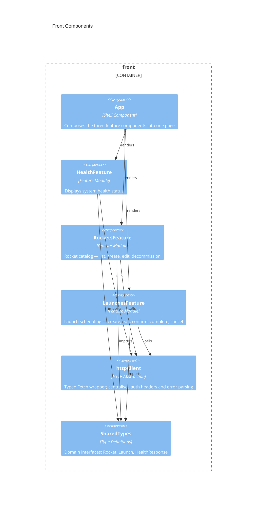

# Front architecture — My-Investor (ab-java-react)

> Container `front` from [`system.arch.md`](./system.arch.md). Tier: `front`.

## Overview

The `front` container is a React 19 + TypeScript SPA (Vite) that lets operators manage the rocket fleet and schedule launches via a single-page view. It calls the backend REST API over HTTP/JSON through a Vite dev-proxy (`/api` → `localhost:8080`) and a shared `httpClient` wrapper around the Fetch API. There is no client-side router; all three feature areas render together on one page.

- **Folder**: `front/`
- **Archetype**: TypeScript — React 19 + Vite
- **Talks to**: `back` (REST API at `/api/*`)

---

## Components diagram (C4 L3)



### Code organization

**Pattern**: Feature-based with shared utilities.

```text
front/src/
├── main.tsx                    # React app bootstrap (createRoot)
├── App.tsx                     # Shell — composes HealthStatus, RocketCatalog, LaunchCatalog
├── index.css                   # Global styles and CSS design tokens
├── features/
│   ├── health/
│   │   ├── HealthStatus.tsx    # Displays health metrics (status, database, uptime)
│   │   ├── HealthStatus.css
│   │   ├── useHealth.ts        # Hook: fetches health on mount
│   │   └── healthApi.ts        # API: GET /api/health
│   ├── rockets/
│   │   ├── RocketCatalog.tsx   # List + inline RocketForm for create/edit
│   │   ├── RocketCatalog.css
│   │   ├── useRockets.ts       # Hook: rockets state + create/update/decommission
│   │   └── rocketsApi.ts       # API: GET POST PUT DELETE /api/rockets
│   └── launches/
│       ├── LaunchCatalog.tsx   # List + LaunchForm + LaunchItem with status transitions
│       ├── LaunchCatalog.css
│       ├── useLaunches.ts      # Hook: launches state + create/update/transition
│       └── launchesApi.ts      # API: GET POST PUT PATCH /api/launches
└── shared/
    ├── api/
    │   └── httpClient.ts       # Typed Fetch wrapper (get, post, put, patch, del)
    └── types/
        ├── health.ts           # HealthResponse, Status
        ├── rockets.ts          # Rocket, RocketRequest, RocketRange
        └── launches.ts         # Launch, LaunchRequest, LaunchStatusRequest, LaunchStatus
```

### Key contracts

| Contract | Shape | Direction |
|----------|-------|-----------|
| `GET /api/health` | `HealthResponse` | consumes |
| `GET /api/rockets` | `Rocket[]` | consumes |
| `POST /api/rockets` | body: `RocketRequest` → `Rocket` | consumes |
| `PUT /api/rockets/{id}` | body: `RocketRequest` → `Rocket` | consumes |
| `DELETE /api/rockets/{id}` | `void` | consumes |
| `GET /api/launches` | `Launch[]` | consumes |
| `POST /api/launches` | body: `LaunchRequest` → `Launch` | consumes |
| `PUT /api/launches/{id}` | body: `LaunchRequest` → `Launch` | consumes |
| `PATCH /api/launches/{id}/status` | body: `LaunchStatusRequest` → `Launch` | consumes |

---

## Data Schemas

### Domain types (`src/shared/types/`)

**health.ts**
```typescript
type Status = 'UP' | 'DOWN'
type HealthResponse = { status: Status; database: Status; uptime: number; timestamp: string }
```

**rockets.ts**
```typescript
type RocketRange = 'Earth' | 'Moon' | 'Mars'
interface Rocket         { id: string; name: string; capacity: number; range: RocketRange; decommissioned: boolean }
interface RocketRequest  { name: string; capacity: number; range: RocketRange }
```

**launches.ts**
```typescript
type LaunchStatus        = 'created' | 'confirmed' | 'completed' | 'cancelled'
interface Launch         { id: string; rocketId: string; rocketName: string; scheduledAt: string; pricePerTicket: number; minimumOccupancy: number; status: LaunchStatus }
interface LaunchRequest  { rocketId: string; scheduledAt: string; pricePerTicket: number; minimumOccupancy: number }
interface LaunchStatusRequest { status: LaunchStatus }
```

> last updated: 2026-06-10
