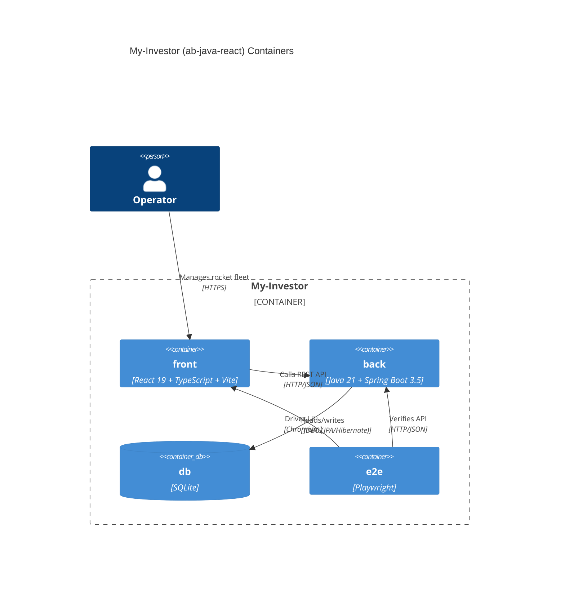
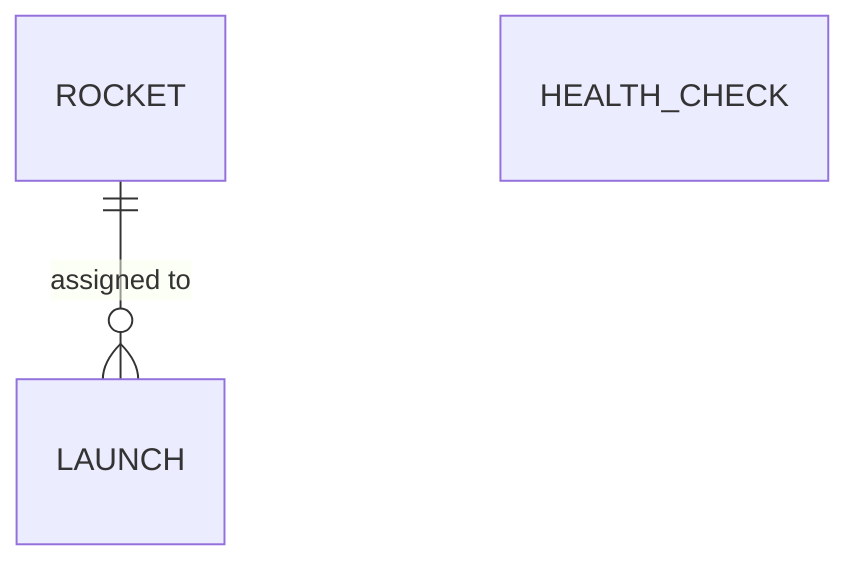

# System architecture — My-Investor (ab-java-react)

## Overview

A full-stack web application for space-launch operators to manage a rocket fleet
(register, browse, update, decommission) backed by a health-check archetype. A React
single-page app talks over HTTP/JSON to a Spring Boot REST API, which persists data to a
local SQLite database via JPA/Hibernate. A Playwright suite exercises the running stack
end to end.

---

## Containers diagram

### Containers table
| Container | Technology | Responsibility |
|-----------|------------|----------------|
| [back](./back.arch.md) | Java 21, Spring Boot 3.5 (web, data-jpa) | REST API under `/api/*`; rockets, launches, and health domains; persistence |
| [front](./front.arch.md) | React 19, TypeScript, Vite | Single-page UI; rocket catalog and health views; HTTP client to the API |
| [db](./db.arch.md) | SQLite (`back/data/app.db`) | Relational storage; schema auto-managed by Hibernate (`ddl-auto: update`) |
| [e2e](./e2e.arch.md) | Playwright + TypeScript | End-to-end tests booting the real API + SPA |

**Notes**
- API base URL `http://localhost:8080`; SPA dev server `http://localhost:5173`.
- CORS on the API allows the SPA origin (`shared/CorsConfig.java`).

---

## Entity-Relationship diagram

> Canonical, system-wide entity model. Specs reference a feature subset; container docs add physical schemas.

`HEALTH_CHECK` is independent from the rocket/launch domain.

---

> last updated: 2026-06-10
