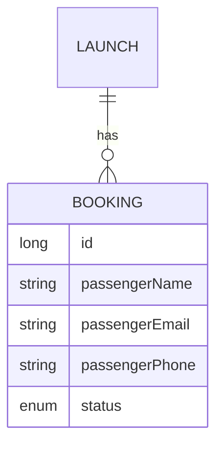

# Specification — Rocket Launch Bookings

## Problem definition

Space-launch operators need to register and manage passenger bookings for specific rocket launches. Each booking must capture the passenger's contact details and reflect whether the seat is confirmed or has been cancelled.

### User Stories

- As an operator, I want to **create a booking for a launch** so that a passenger's seat is registered against that flight.
- As an operator, I want to **view all bookings for a launch** so that I know who is scheduled to fly.
- As an operator, I want to **cancel a booking** so that the seat is marked as no longer active.
- As an operator, I want to **browse all bookings across all launches** so that I have a complete passenger overview.

### Business rules

- A booking must be linked to an existing launch.
- Passenger name, email, and phone number are all required to create a booking.
- A new booking always starts with status `created`.
- A booking can transition from `created` to `cancelled`; cancelled bookings cannot be reactivated.
- Bookings are never deleted — only cancelled.

## Solution overview

> Expected results only — outcomes, not implementation. `/planify` turns these into steps per container.

### Data Model

Status values: `CREATED`, `CANCELLED`.

### back

The API must expose booking management for launches.

- A booking can be created for a given launch by providing passenger name, email, and phone; the response includes the assigned booking id and status `created`.
- All bookings for a launch can be retrieved as a list.
- A single booking can be retrieved by its id.
- A booking can be cancelled; the response reflects the updated status.
- Creating a booking for a non-existent launch returns an error.
- Creating a booking with a missing required field returns a validation error.

### front

The SPA must allow operators to view and manage bookings.

- A bookings list view shows all bookings for a selected launch, displaying passenger name, email, phone, and current status.
- An operator can open a form to create a new booking for a launch, providing name, email, and phone.
- An operator can cancel a booking from the list view; the status updates immediately in the UI.
- Cancelled bookings are visually distinguished from active ones.

### db

The database must persist booking records.

- A `BOOKING` table stores each booking with its passenger details, status, and a foreign-key reference to the parent `LAUNCH` record.

## Verification

### Acceptance criteria

- [ ] When a booking is submitted with valid passenger details for an existing launch, it is stored with status `created` and returned to the caller.
- [ ] When a booking is cancelled, its status changes to `cancelled` and the change is persisted.
- [ ] When bookings are listed for a launch, all bookings (both `created` and `cancelled`) are returned.
- [ ] When a booking is requested for a launch that does not exist, the API returns a not-found error.
- [ ] When a booking is submitted with any required field missing, the API returns a validation error.

### Additional criteria

- [ ] A cancelled booking cannot be reactivated via the API.
- [ ] The front-end booking form validates that name, email, and phone are filled before submitting.
- [ ] Cancelled bookings are visually distinct in the bookings list.
