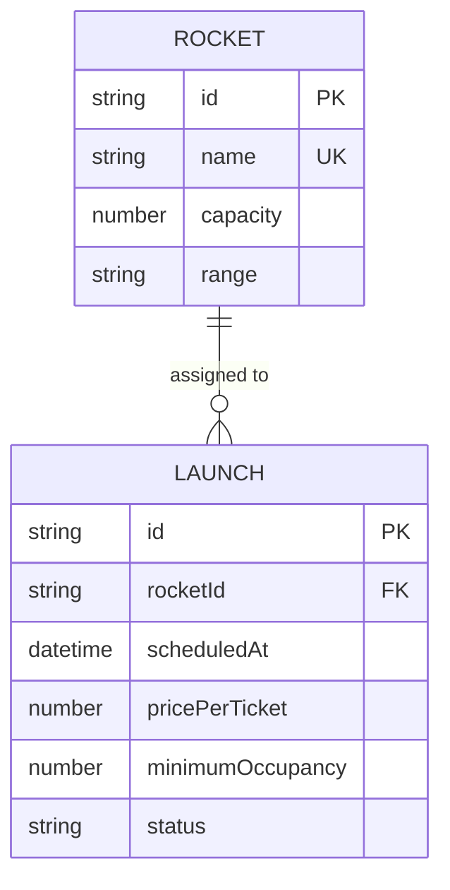

# Specification — Launches Management

## Problem definition

Space-launch operators need to schedule and manage rocket launches: assigning a rocket,
setting the departure time, defining ticket pricing, enforcing a minimum occupancy
threshold, and tracking the launch through its lifecycle until completion or cancellation.

### User Stories

- As an operator, I want to **schedule a launch for a rocket** so that I can plan upcoming missions.
- As an operator, I want to **browse the launch catalog** so that I can monitor all scheduled and past launches.
- As an operator, I want to **confirm a launch** so that the mission is officially approved to proceed.
- As an operator, I want to **complete a launch** so that its outcome is recorded in the system.
- As an operator, I want to **cancel a launch** so that I can remove missions that will not proceed.

### Business rules

- A launch must be linked to an existing, active (non-decommissioned) rocket.
- A launch must have a scheduled time in the future at the moment of creation.
- A launch must have a price per ticket greater than zero.
- A launch must have a minimum occupancy between 1 and the assigned rocket's capacity.
- A rocket with launches in `created` or `confirmed` status cannot be decommissioned.
- Status transitions are strictly ordered:

  | From      | Allowed transitions     |
  |-----------|-------------------------|
  | created   | confirmed, cancelled    |
  | confirmed | completed, cancelled    |
  | completed | _(terminal)_            |
  | cancelled | _(terminal)_            |

## Solution overview

> Expected results only — outcomes, not implementation. `/planify` turns these into steps per container.

### Data Model

### Backend API

The API must expose full lifecycle management of launches:

- An endpoint to create a launch linked to a rocket, with scheduled time, price per ticket, and minimum occupancy.
- An endpoint to list all launches (with rocket details included).
- An endpoint to retrieve a single launch by its ID.
- An endpoint to update the editable fields of a launch in `created` status (time, price, minimum occupancy).
- An endpoint to transition a launch status (confirm, complete, cancel) following the allowed rules.
- Validation errors are returned when data is invalid or a transition is not allowed.

### Frontend Application

The SPA must let operators manage launches end-to-end:

- A form to schedule a new launch, picking a rocket from the active fleet and entering time, price, and minimum occupancy.
- A view listing all launches with their current status and key details.
- Controls to confirm, complete, or cancel a launch, respecting allowed transitions.
- A form to edit a `created` launch's details.

### Database

The database must persist launches alongside rockets:

- A `LAUNCH` table storing all launch fields and a foreign key to `ROCKET`.
- The schema is auto-managed; no manual migration is required.

## Verification

### Acceptance criteria

- [ ] WHEN a launch is created with valid data and an active rocket, THEN it appears in the launch list with status `created`.
- [ ] IF a launch is created with a past scheduled time or invalid price/occupancy, THEN the system returns an appropriate error.
- [ ] IF a rocket is decommissioned while it has a `created` or `confirmed` launch, THEN the decommission is rejected.
- [ ] WHEN a `created` launch is confirmed, THEN its status changes to `confirmed`.
- [ ] WHEN a `confirmed` launch is completed, THEN its status changes to `completed`.
- [ ] WHEN a launch is cancelled (from `created` or `confirmed`), THEN its status changes to `cancelled`.
- [ ] IF a status transition is not allowed (e.g. completing a `cancelled` launch), THEN the system returns an error.
- [ ] WHEN the launch list is viewed, THEN all launches are displayed with their rocket name and current status.

### Additional criteria

- [ ] A decommissioned rocket is not selectable when scheduling a new launch.
- [ ] Editing a launch is only possible when its status is `created`.
